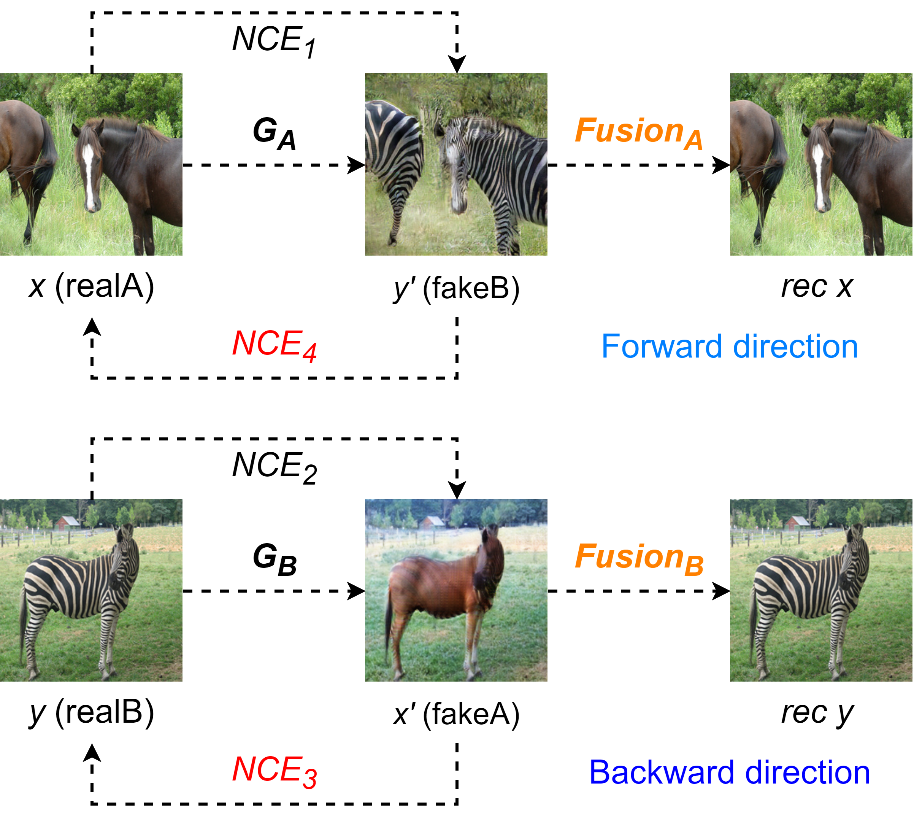
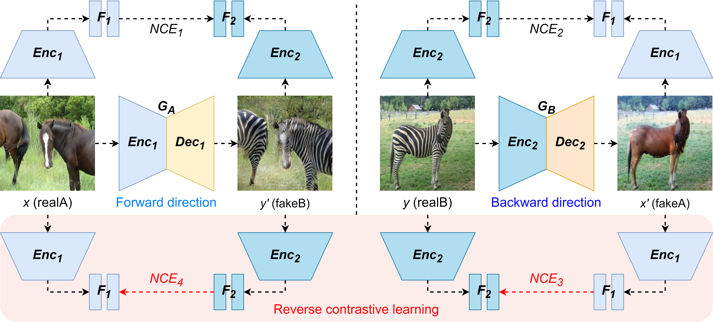
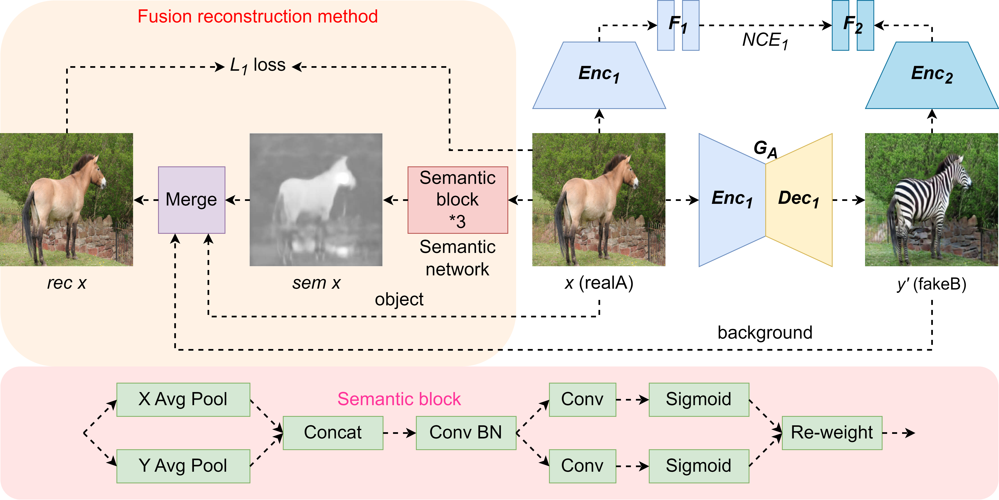

# BC-FR: Bijective Contrast and Fusion Reconstruction Networks for Unpaired Image-to-Image Translation


## 📝 Overview


BC-FR



BC



FR




## 🚀 Usage

1. Training

```
python train.py --dataroot ./datasets/
```


2. Testing

```
python test.py --dataroot ./datasets/ --num_test 120
```
